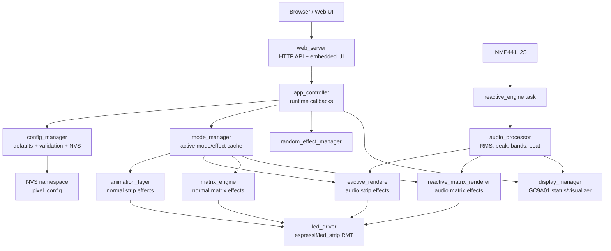
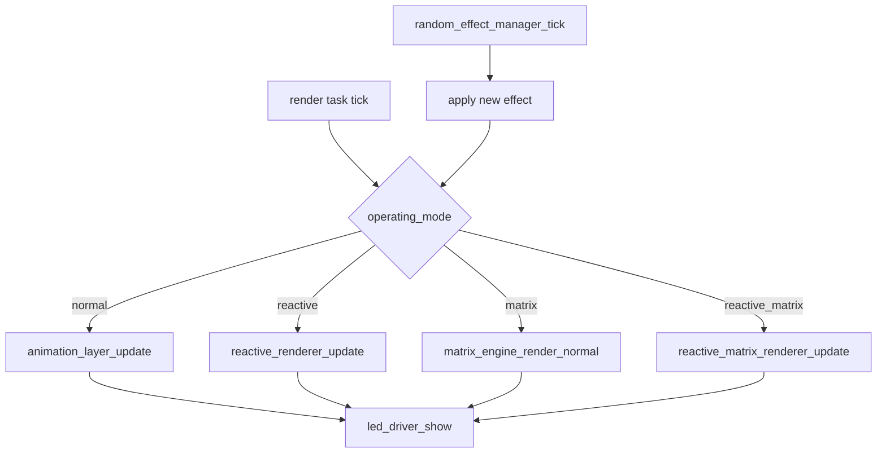
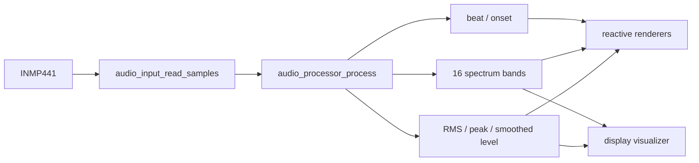
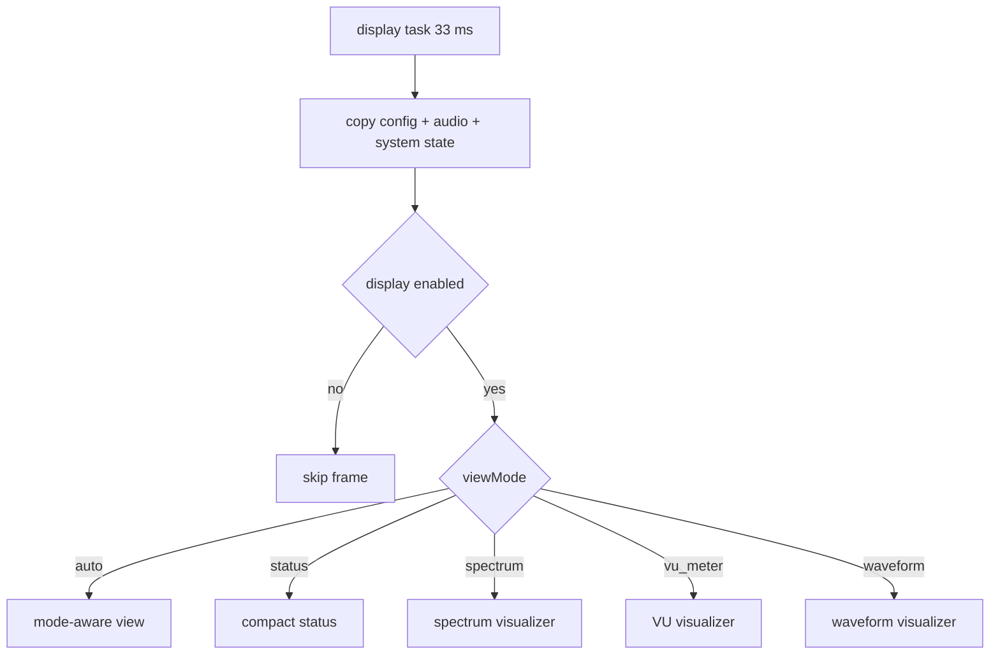
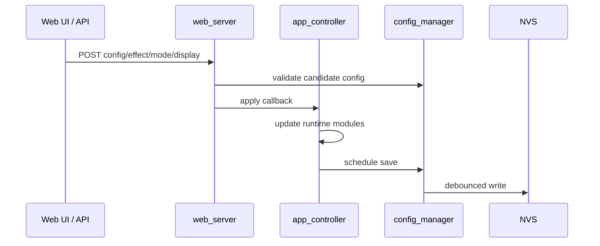

# Firmware Architecture

Firmware ini adalah ESP-IDF LED controller untuk strip addressable, reactive
audio dari INMP441, Web UI lokal, dan display GC9A01. Semua konfigurasi runtime
utama disimpan di NVS melalui `config_manager`.

## Runtime Overview

## Main Tasks

| Task | Owner | Cadence | Purpose |
| --- | --- | --- | --- |
| Render task | `app_controller` | about 33 ms | Updates LED effects and calls `led_driver_show`. |
| Display task | `app_controller` | about 33 ms | Updates GC9A01 without blocking LED rendering. |
| Config save task | `app_controller` | event/debounce | Writes pending config changes to NVS. |
| Audio task | `reactive_engine` | only reactive modes | Reads INMP441 samples and updates audio features. |
| HTTP server | `web_server` | request driven | Serves UI and JSON API. |

LED rendering stays the priority path. Display and config saving run at lower
priority and avoid blocking delays.

## Components

| Component | Role |
| --- | --- |
| `main` | ESP-IDF entry point; starts `app_controller`. |
| `app_controller` | Initializes services, owns callbacks, starts tasks, applies runtime changes. |
| `config_manager` | Default config, target-aware pins, validation, NVS persistence. |
| `mode_manager` | Caches mode/effect selection so render loop does not read NVS. |
| `effect_registry` | Metadata for normal, reactive, matrix, and reactive matrix effects. |
| `led_driver` | LED strip abstraction using ESP-IDF RMT via `espressif/led_strip`. |
| `animation_layer` | Normal/basic strip effects. |
| `audio_input` | INMP441 I2S input driver. |
| `audio_processor` | RMS/peak/noise gate/auto gain/beat/bass-mid-treble/spectrum bands. |
| `reactive_engine` | Audio FreeRTOS task and start/stop lifecycle for reactive modes. |
| `reactive_renderer` | Audio reactive effects for linear strips. |
| `matrix_engine` | 2D matrix mapping and normal matrix rendering. |
| `reactive_matrix_renderer` | Audio reactive effects for matrix layouts. |
| `palette_manager` | Built-in palette registry and palette lookup. |
| `random_effect_manager` | Auto-play/random effect selection with no-repeat option. |
| `display_manager` | GC9A01 boot screen, status icons, and audio visualizer. |
| `system_monitor` | Runtime metrics used by Web UI and display. |
| `web_server` | Embedded Web UI, REST API, effect metadata, and config updates. |
| `wifi_service` | Default SoftAP service. |

## Mode Flow

Modes exposed by API:

- `normal`
- `reactive`
- `matrix`
- `reactive_matrix`

Reactive modes start the audio pipeline. Non-reactive modes stop it.

## Audio Flow

The processor exposes:

- raw, RMS, peak, smoothed, and 8-bit volume levels
- noise floor, DC offset, clipped sample count
- bass, mid, treble levels
- beat/onset flags
- dominant frequency and spectral centroid
- up to 16 spectrum bands

## Display Flow

Current visual direction is minimal text after boot, with realtime WiFi/FPS
status and audio-reactive animation.

## Config Lifecycle

Settings are applied immediately, then persisted. If NVS contains invalid data,
the firmware falls back to defaults.

## Target Awareness

Board defaults are centralized in
`components/config_manager/include/board_profile.h`.

ESP-IDF still requires one binary per chip target. The source tree is shared,
but release artifacts are built separately for `esp32`, `esp32s2`, `esp32s3`,
`esp32c3`, and `esp32c6`.

## Performance Notes

- LED render target is about 30 FPS.
- Display refresh target is about 20-30 FPS and runs separately.
- Audio processing starts only in reactive modes.
- Config saves are debounced and not performed inside the LED render loop.
- LED and audio pins are validated with ESP-IDF GPIO capability macros.
- Maximum LED count is bounded by `CONFIG_LED_COUNT_MAX`.
- Matrix layout is bounded to 32 x 32.
